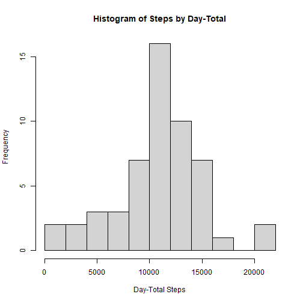
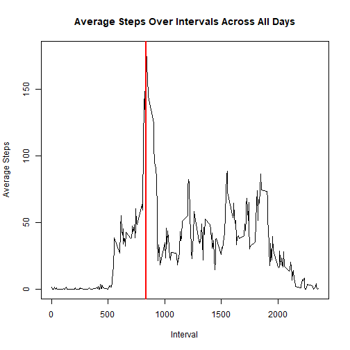
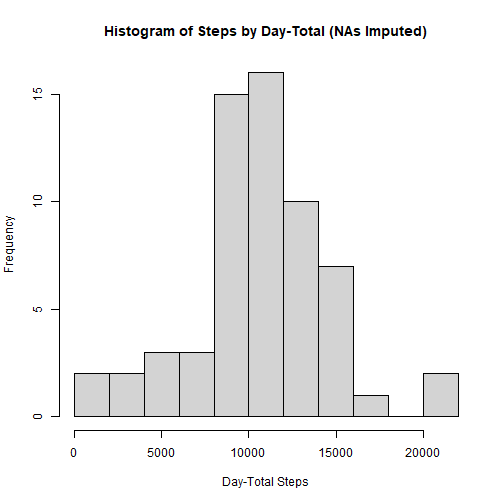
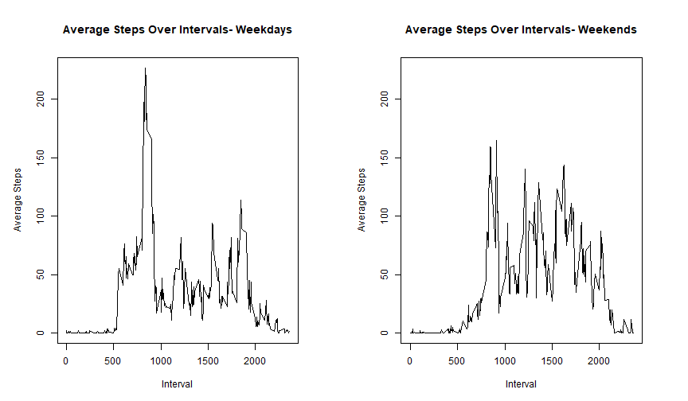

## Loading and preprocessing data  

Here I load the dataset from the unzipped file. Then I classify the date column as a date.  

```r
unzip("repdata_data_activity.zip")
activity <- read.csv("activity.csv", sep=",")
activity$date <- as.Date.character(activity$date)
```

## What is mean total number of steps taken per day? 

The following code groups the activity dataset by the date and takes the sum of the steps for each day. Then a histogram of is plotted of the frequency of these sums. The mean and median of these sums are also outputted.  

```r
stepsums <- aggregate(steps ~ date, activity, sum, na.action = na.omit)
hist(stepsums$steps,breaks=10,main="Histogram of Steps by Day-Total"
     ,xlab="Day-Total Steps")
```



```r
mean1 <- mean(stepsums$steps)
median1 <- median(stepsums$steps)
print(c(mean1,median1))
```

```
## [1] 10766.19 10765.00
```
So the mean number of steps taken per day is 10766.19  

## What is the average daily activity pattern?  
This code calculates the average number of steps for each interval across all days. A time series plot is shown, as well as the interval with the maximum number of average steps. This is the red line on the plot.  


```r
intsums <- aggregate(steps ~ interval, activity, sum, na.action = na.omit)
intsums$steps <- intsums$steps/length(unique(activity$date))
plot(intsums$interval,intsums$steps,type="l",xlab="Interval",ylab="Average Steps"
     ,main="Average Steps Over Intervals Across All Days")
maxind <- which.max(intsums$steps)
maxint <- intsums$interval[maxind]
abline(v=maxint,col="red",lw=2)
```



```r
print(maxint)
```

```
## [1] 835
```
The 5-minute interval 835 has the maximum average steps taken.  

## Imputing missing values  
The following code finds and counts the indices of missing values in the activity dataset. The replacena function replaces missing step values with the average number of steps for the relevant interval. activity2 is the dataset with the missing values filled in. The histogram plotted shows the frequency of the day-total sums of this new dataset. Also displayed is mean and median of these new sums.  


```r
missingind <- which(is.na.data.frame(activity))
nummissing <- length(missingind)
replacena <- function(df) {
    for(i in 1:nrow(df)) {
        if(i %in% missingind) {
            int <- df[i,]$interval
            avgsteps <- intsums[match(int,intsums$interval),]$steps
            df[i,]$steps <- avgsteps
      }
    }
  df
}
activity2 <- replacena(activity)
stepsums2 <- aggregate(steps ~ date, activity2, sum, na.action = na.omit)
hist(stepsums2$steps,breaks=10,main="Histogram of Steps by Day-Total (NAs Imputed)"
       ,xlab="Day-Total Steps")
```



```r
mean2 <- mean(stepsums2$steps)
median2 <- median(stepsums2$steps)
print(nummissing)
```

```
## [1] 2304
```

```r
print(c(mean2,median2))
```

```
## [1] 10581.01 10395.00
```
We find that there are 2304 missing values in the dataset. The mean and median of the new dataset, activity2, are both lower than the corresponding measures for the original dataset.  We can conclude that imputing the missing values lowers the estimate of the total daily number of steps.  

## Are there differences in activity patterns between weekdays and weekends?  
Here the second activity dataset is grouped by whether it is a weekday or on the weekend. The average number of steps per interval across all days is computed. Time series plots for these two categories are plotted side-by-side.  

```r
library(lubridate)
days <- wday(activity2$date)
days[days==1 | days==7] <- "weekend"
days[days %in% 2:6] <- "weekday"
activity2$days <- days
wday <- subset(activity2,days=="weekday")
wend <- subset(activity2,days=="weekend")
wdaysums <- aggregate(steps ~ interval, wday, sum)
wendsums <- aggregate(steps ~ interval, wend, sum)
wdaysums$steps <- wdaysums$steps/length(unique(wday$date))
wendsums$steps <- wendsums$steps/length(unique(wend$date))

par(mfrow=c(1,2),mar=c(5,5,5,4))
plot(wdaysums$interval,wdaysums$steps,type="l",xlab="Interval",ylab="Average Steps"
     ,main="Average Steps Over Intervals- Weekdays")
plot(wendsums$interval,wendsums$steps,type="l",ylim = range(wdaysums$steps),xlab="Interval",ylab="Average Steps"
     ,main="Average Steps Over Intervals- Weekends")
```


Looking at the plots, it appears that the average number of steps for weekdays increases at earlier intervals when compared to the weekend plot. We can also see that the weekday plot has a higher maximum. However, the weekend plot has generally higher numbers of steps at later intervals.  
